<p align="center">
  <a href="https://project.christiantadros.com/sortlab/">
    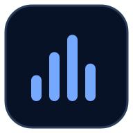
  </a>
</p>

<h1 align="center">SortLab</h1>

<p align="center">
  <strong>See, hear, compare, and understand sorting algorithms.</strong>
</p>

<p align="center">
  An open-source learning environment for guided visualization, synchronized comparison, measured benchmarks, and high-scale Canvas playback.
</p>

<p align="center">
  <a href="https://project.christiantadros.com/sortlab/">
    
  </a>
  <a href="https://github.com/ctadros1/sort-lab">
    
  </a>
</p>

<p align="center">
  <a href="#-why-sortlab">Features</a> ·
  <a href="#-product-tour">Product tour</a> ·
  <a href="#-run-sortlab-locally">Local setup</a> ·
  <a href="#-project-documentation">Documentation</a> ·
  <a href="#-contribute">Contribute</a>
</p>

<p align="center">
  
  
  
  
  
</p>

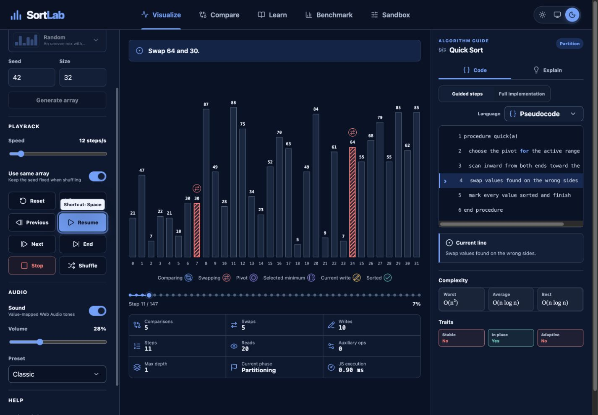

## ✨ Why SortLab

SortLab converts each algorithm into a structured operation stream. The same stream powers animation, narration, statistics, code highlighting, sound, comparison, and reverse stepping.

<table>
  <tr>
    <td width="50%">
      <h3>🎬 Guided visualization</h3>
      <p>Follow comparisons, swaps, pivots, writes, ranges, recursion, and finalized values one operation at a time.</p>
    </td>
    <td width="50%">
      <h3>🎧 Operation-aware sound</h3>
      <p>Hear value-mapped Web Audio tones with bounded polyphony, adaptive density, and click-free envelopes.</p>
    </td>
  </tr>
  <tr>
    <td width="50%">
      <h3>⚖️ Side-by-side comparison</h3>
      <p>Run two algorithms on the same seeded array with synchronized progress and a balanced sound crossfader.</p>
    </td>
    <td width="50%">
      <h3>📖 Code and explanation</h3>
      <p>Connect every visible operation to guided pseudocode, complete reference code, narration, and worked examples.</p>
    </td>
  </tr>
  <tr>
    <td width="50%">
      <h3>📊 Measured benchmarks</h3>
      <p>Compare copied inputs through cancellable Web Worker trials without treating animation time as execution time.</p>
    </td>
    <td width="50%">
      <h3>🧪 High-scale Sandbox</h3>
      <p>Render thousands of values on Canvas with searchable algorithms, dataset previews, and advanced audiovisual controls.</p>
    </td>
  </tr>
</table>

## 🖼 Product tour

Every primary page supports light, dark, and system themes. The responsive layouts preserve the same algorithms and controls from desktop to phone.

### Visualize an algorithm step by step

Visualize keeps the controls, array, and algorithm guide visible together. Change speed during playback, step in either direction, and inspect the operation that produced the current state.

<table>
  <tr>
    <td width="50%">
      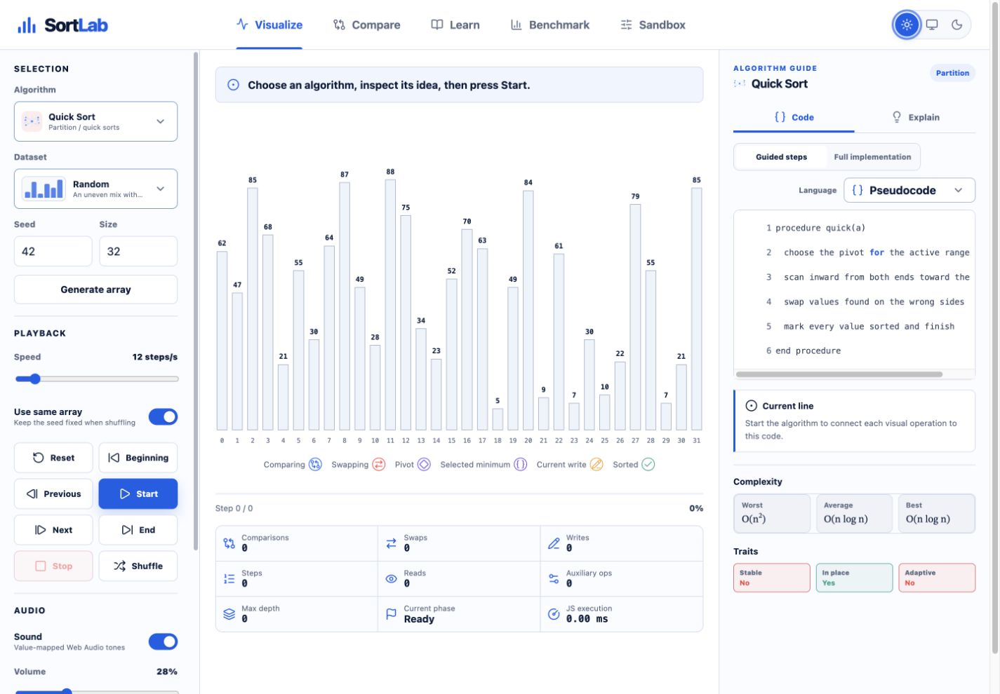
      <br><sub>Light mode with generated values, operation legend, statistics, and guided pseudocode.</sub>
    </td>
    <td width="50%">
      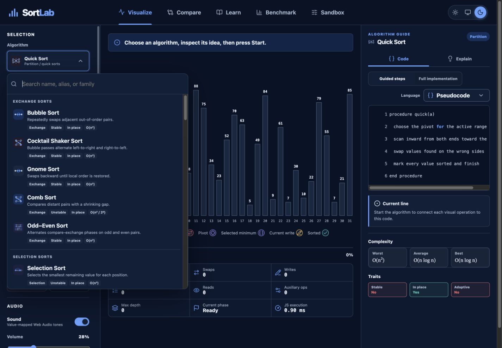
      <br><sub>Dark-mode algorithm picker with custom icons, traits, complexity, search, and family groups.</sub>
    </td>
  </tr>
</table>

### Compare algorithms on identical input

Compare synchronizes relative progress while preserving each algorithm’s operations and measured execution time. Move the sound crossfader to emphasize either side.

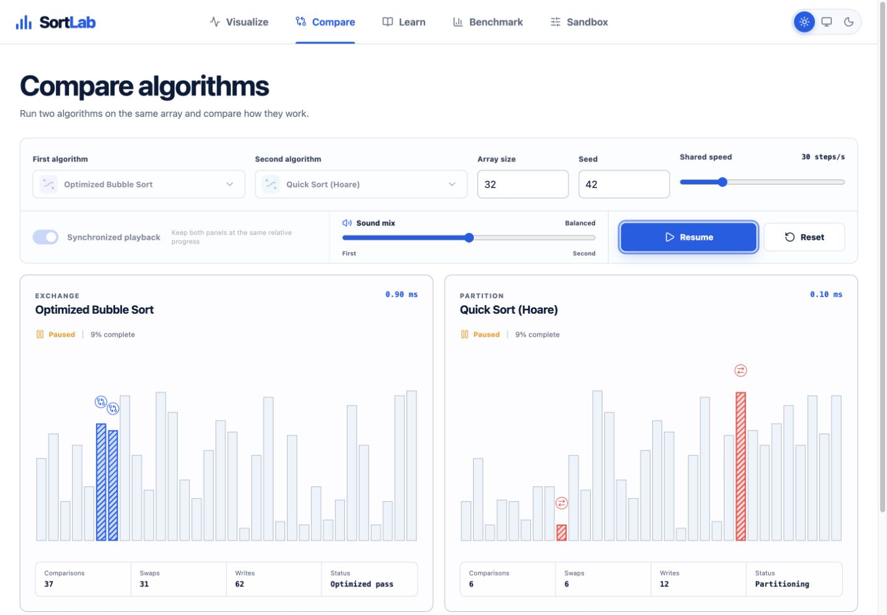

### Learn each algorithm as a focused lesson

Learn starts with a searchable catalog, then opens each algorithm as a dedicated page with key facts, a central idea, worked examples, and implementation guidance.

<table>
  <tr>
    <td width="50%">
      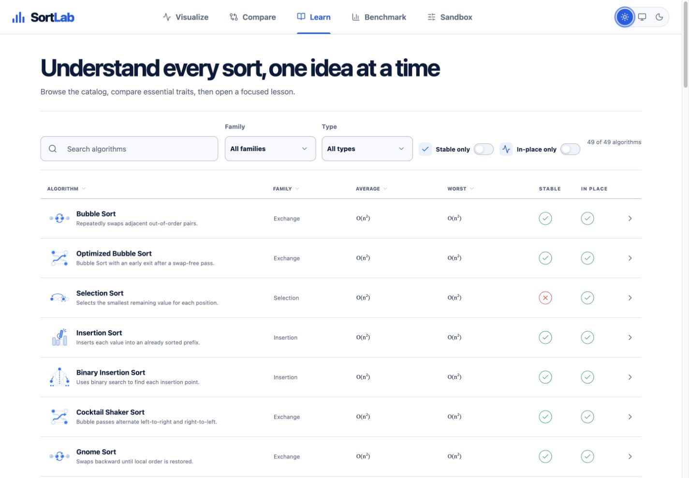
      <br><sub>Light-mode catalog with family, type, stability, and memory filters.</sub>
    </td>
    <td width="50%">
      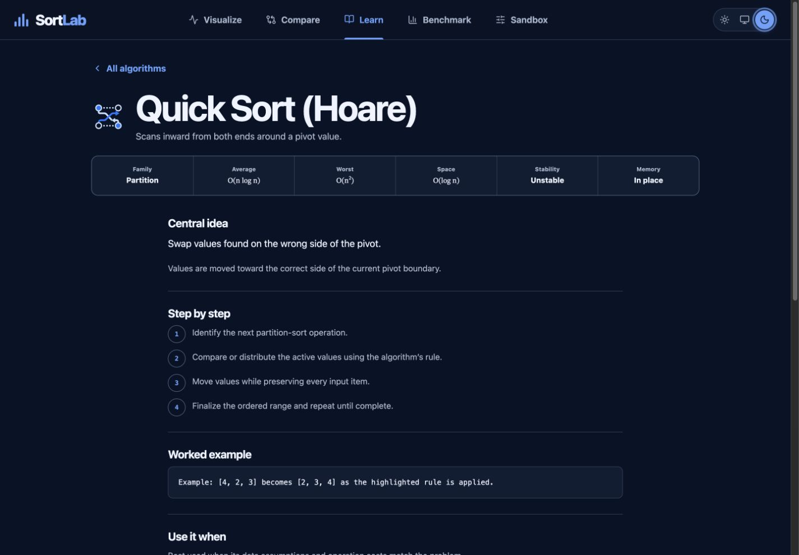
      <br><sub>Dark-mode Quick Sort lesson with complexity, traits, steps, and a worked example.</sub>
    </td>
  </tr>
</table>

### Benchmark copied arrays

Benchmark runs one warm-up and multiple copied trials in a Web Worker. The chart reports observed medians for the current browser and device, not universal rankings.

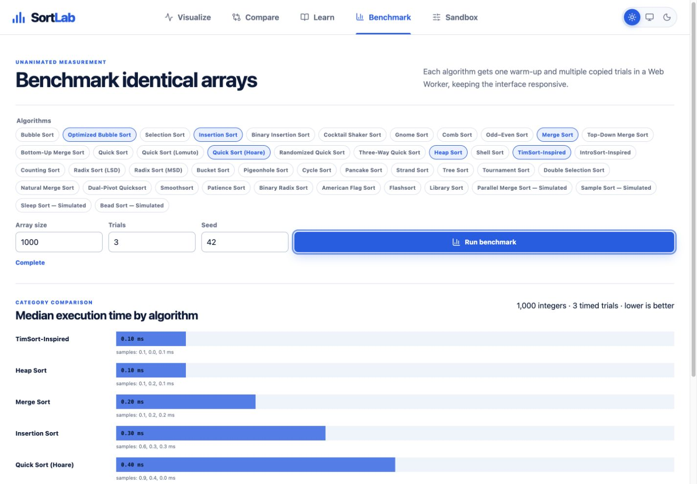

### Scale up in Sandbox

Sandbox renders large arrays on Canvas and keeps advanced playback, audio, and visual controls in a focused panel. Dataset previews show each distribution before selection.

<table>
  <tr>
    <td width="50%">
      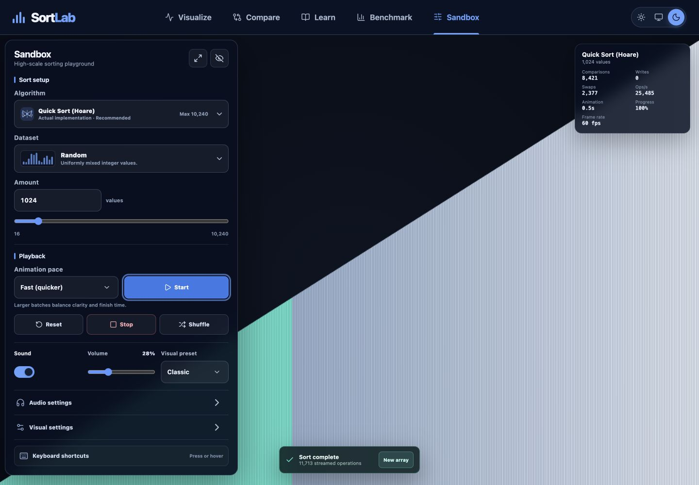
      <br><sub>Dark-mode completion state for a 1,024-value worker-driven Quick Sort.</sub>
    </td>
    <td width="50%">
      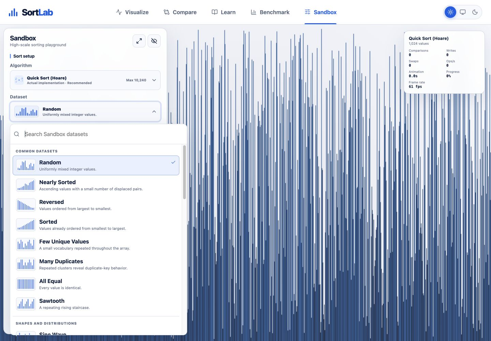
      <br><sub>Light-mode dataset picker with visual previews and searchable distributions.</sub>
    </td>
  </tr>
</table>

### Inspect the project’s design and limits

About explains the event model, browser limits, timing methodology, accessibility choices, source availability, and technical stack.

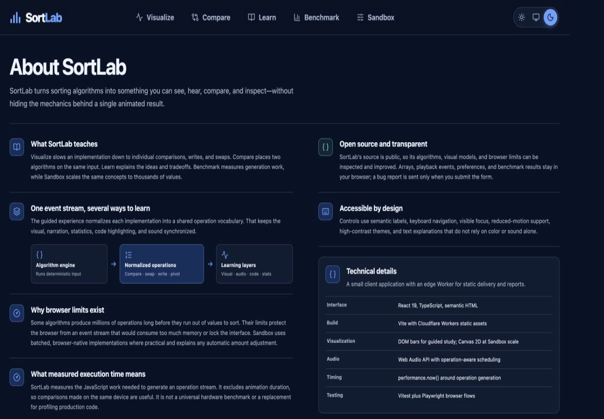

### Continue on a phone

The guided visualizer becomes a single-column lesson. Sandbox uses a draggable control sheet over the Canvas.

<table>
  <tr>
    <td width="50%">
      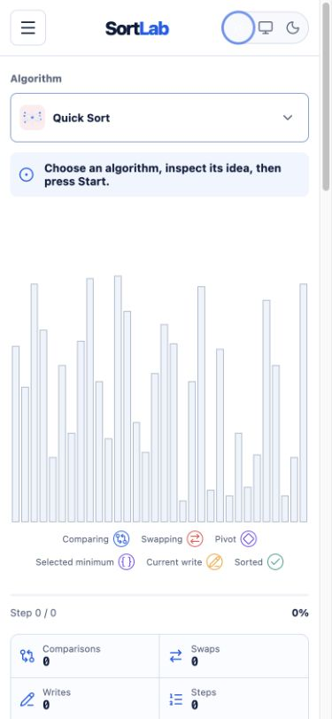
      <br><sub>Visualize in a compact light-mode phone layout.</sub>
    </td>
    <td width="50%">
      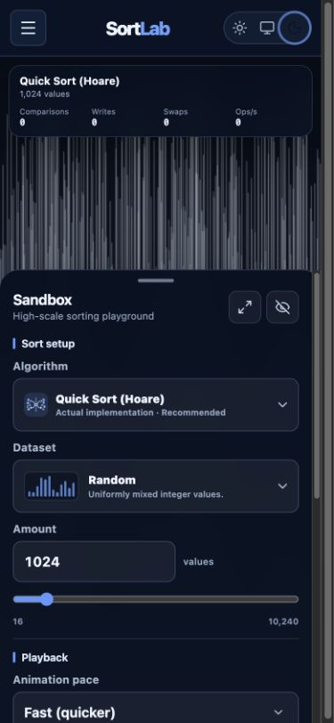
      <br><sub>Sandbox in a compact dark-mode phone layout.</sub>
    </td>
  </tr>
</table>

## 🧭 Explore the learning tools

The five product areas share seeded datasets, algorithm metadata, semantic states, and accessible controls.

| Area          | Purpose                                | Highlights                                                                      |
| ------------- | -------------------------------------- | ------------------------------------------------------------------------------- |
| **Visualize** | Study one algorithm closely            | Reverse stepping, narration, statistics, sound, pseudocode, complete code       |
| **Compare**   | Contrast two strategies                | Shared input, synchronized progress, measured generation time, audio crossfader |
| **Learn**     | Build conceptual understanding         | Searchable catalog, complexity, traits, examples, mistakes, use cases           |
| **Benchmark** | Observe unanimated execution           | Warm-up, copied arrays, repeated trials, medians, cancellation                  |
| **Sandbox**   | Explore scale and audiovisual patterns | Canvas rendering, worker playback, 200-plus entries, advanced controls          |

### Generated datasets

Use seeded random values or choose distributions that reveal different algorithm behavior:

- Random, nearly sorted, reversed, and sorted
- Few unique values, many duplicates, and all equal
- Sawtooth and grouped distributions
- Custom integer arrays in guided views

### Languages in the algorithm guide

The guided code view supports:

`Pseudocode` · `C / C++` · `Java` · `Python` · `TypeScript`

## 🧠 Algorithm coverage

Learn includes 49 curated teaching algorithms. Sandbox expands the catalog to more than 200 named and categorized entries, with clear Native, Conceptual, Simulated, or Experimental labels.

<details>
  <summary><strong>Introductory, exchange, selection, and insertion sorts</strong></summary>
  <br>
  Bubble Sort, Cocktail Shaker Sort, Odd–Even Sort, Comb Sort, Gnome Sort, Selection Sort, Double Selection Sort, Insertion Sort, Binary Insertion Sort, Shell Sort, and Library Sort.
</details>

<details>
  <summary><strong>Efficient comparison and hybrid sorts</strong></summary>
  <br>
  Merge Sort, Bottom-Up Merge Sort, Natural Merge Sort, Quick Sort variants, Heap Sort, Smoothsort, TimSort-inspired, and IntroSort-inspired implementations.
</details>

<details>
  <summary><strong>Distribution, network, specialized, and novelty sorts</strong></summary>
  <br>
  Counting Sort, Pigeonhole Sort, Bucket Sort, Radix variants, American Flag Sort, Flashsort, Cycle Sort, Pancake Sort, Strand Sort, Tree Sort, Tournament Sort, Patience Sort, Bitonic Sort, Batcher Odd–Even Merge Sort, and bounded novelty demonstrations.
</details>

Educational approximations are labeled where their behavior differs from a production library or formal optimized implementation. SortLab does not claim instruction-for-instruction parity with Python, Java, V8, or the C++ standard library.

## 🏗 Technical architecture

SortLab is a client application with an edge Worker for static delivery and bug reports.

```text
Algorithm generators
        │
        ▼
Normalized operation stream
        │
        ├── Visual state and reverse stepping
        ├── Narration and code highlighting
        ├── Statistics and progress
        └── Web Audio scheduling

High-scale algorithms ──► Web Worker ──► Canvas 2D renderer
Benchmarks            ──► Web Worker ──► Median result chart
```

| Layer                 | Technology                                    |
| --------------------- | --------------------------------------------- |
| Interface             | React 19, TypeScript, semantic HTML           |
| Build                 | Vite 8                                        |
| Guided visualization  | DOM bars with patterns and markers            |
| Sandbox visualization | Canvas 2D with worker-driven playback         |
| Audio                 | Web Audio API with operation-aware scheduling |
| Testing               | Vitest and Playwright                         |
| Delivery              | Cloudflare Workers static assets              |

## ♿ Accessibility

SortLab treats accessibility as part of the interaction model:

- Semantic labels and visible focus across every control
- Keyboard navigation for pickers, playback, themes, and Sandbox tools
- Patterns, markers, text, and sound that avoid color-only meaning
- Light, dark, and system themes with reduced-motion support
- Screen-reader operation updates and structured complexity notation
- Responsive layouts without horizontal page overflow

### Keyboard shortcuts

| Key                         | Visualize               | Sandbox                                 |
| --------------------------- | ----------------------- | --------------------------------------- |
| <kbd>Space</kbd>            | Start, pause, or resume | Start, pause, or resume                 |
| <kbd>←</kbd> / <kbd>→</kbd> | Previous or next event  | Change playback speed                   |
| <kbd>R</kbd>                | Reset                   | Reset                                   |
| <kbd>S</kbd>                | Shuffle                 | Shuffle                                 |
| <kbd>M</kbd>                | Toggle sound            | Toggle sound                            |
| <kbd>H</kbd>                | Not available           | Hide or show controls                   |
| <kbd>F</kbd>                | Not available           | Enter or leave fullscreen               |
| <kbd>Esc</kbd>              | Stop                    | Restore controls, then leave fullscreen |

Shortcuts do not fire while focus is inside an input, button, or text area.

## 🚀 Run SortLab locally

SortLab requires Node.js 22 or later.

```bash
git clone https://github.com/ctadros1/sort-lab.git
cd sort-lab
npm ci
npm run dev
```

Vite prints the local address after startup. Open that address in a modern browser.

### Quality checks

Run the full local quality suite before submitting a change:

```bash
npm run format:check
npm run lint
npm run typecheck
npm test
npm run test:browser
npm run build
npm audit
```

## 🗂 Project structure

The repository separates algorithms, interfaces, workers, and documentation so each area can evolve without duplicating metadata.

```text
src/
├── algorithms/      # Guided implementations and shared registry
├── audio/           # Web Audio engine and scheduling
├── benchmark/       # Unanimated benchmark worker
├── components/      # Visualize, Compare, Learn, Benchmark, and About
├── sandbox/         # High-scale renderer and algorithm catalog
├── styles/          # Shared, responsive, and product-specific styles
└── tests/           # Unit and component tests

tests/browser/       # Playwright interaction and performance flows
cloudflare/          # Worker entry point
docs/                # Architecture, testing, deployment, and feature guides
public/              # Brand, metadata, and algorithm icon assets
```

## 📚 Project documentation

Use the focused guides when you need implementation detail:

| Guide                                | Covers                                                      |
| ------------------------------------ | ----------------------------------------------------------- |
| [Architecture](docs/architecture.md) | Event flow, state boundaries, workers, and rendering        |
| [Algorithms](docs/algorithms.md)     | Registry metadata, implementation rules, and constraints    |
| [Visualize](docs/visualize.md)       | Guided workspace, code mapping, states, and accessibility   |
| [Sandbox](docs/sandbox.md)           | High-scale rendering, limits, controls, and worker playback |
| [Audio engine](docs/audio-engine.md) | Pitch mapping, density, envelopes, gain, and voice limits   |
| [Testing](docs/testing.md)           | Unit, browser, performance, and regression coverage         |
| [Deployment](docs/deployment.md)     | Production build, health checks, backup, and rollback       |

## 🤝 Contribute

Contributions should preserve deterministic input, accurate operation metadata, accessibility, cancellation, and bounded browser work.

1. Create a focused branch from `main`.
2. Add or update tests with the implementation.
3. Run the quality checks.
4. Open a pull request that explains the user-visible change and its validation.

For a new algorithm, update the generator, centralized registry metadata, icon assignment, input validation, code-line mapping, and focused tests. For a new dataset, add its typed metadata, generator, preview pattern, search terms, and seeded-output coverage.

## 🌐 Deployment

The public site runs from Cloudflare Workers static assets at [project.christiantadros.com/sortlab](https://project.christiantadros.com/sortlab/).

```bash
npm run build:cloudflare
npm run deploy:cloudflare
```

Review the [deployment guide](docs/deployment.md) before changing production or a self-hosted installation.

<p align="center">
  <a href="https://project.christiantadros.com/sortlab/">Open SortLab</a> ·
  <a href="https://github.com/ctadros1/sort-lab/issues">Report an issue</a> ·
  <a href="#sortlab">Back to top</a>
</p>
