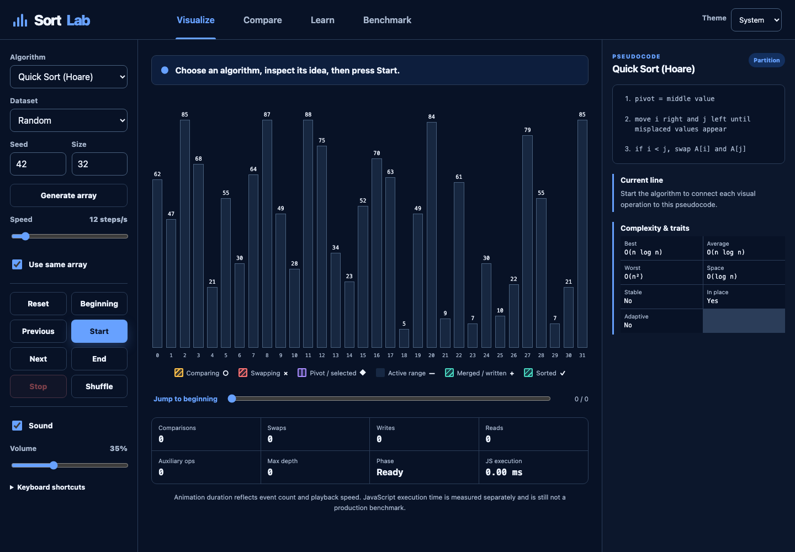

# SortLab

SortLab is a local-first educational sorting algorithm playground for CS1 students. It turns algorithm execution into structured events so students can watch comparisons and writes, step backward and forward, hear value-mapped tones, connect each action to pseudocode, and compare algorithms without confusing animation speed with computational performance.



## LAN access

- URL: `http://192.168.75.59:8787`
- Project directory: `/srv/docker/projects/sorting-playground`
- Container: `sorting-playground`
- Image: `sorting-playground:1.0.0`
- Arcane: `http://192.168.75.59:3552`

The service binds only to the dev-lab LAN address. It has no accounts, database, analytics, telemetry, external fonts, ads, third-party scripts, or public exposure.

## What students can do

- Visualize comparisons, swaps, pivots, ranges, merges, heap operations, bucket assignments, writes, and finalized values using color plus patterns and markers.
- Generate random, nearly sorted, reversed, sorted, few-unique, duplicate-heavy, sawtooth, shuffled-group, or custom integer arrays.
- Reproduce an array with a seed and reuse it across comparisons.
- Start, pause, resume, stop, reset, step backward, step forward, and jump to either end.
- Change speed while a run is active.
- Enable value-mapped Web Audio tones and lower the volume; dense high-speed runs automatically reduce tone frequency.
- Read deterministic narration, live operation counters, recursion depth, phase, JavaScript execution time, and pseudocode highlighting.
- Compare two algorithms on the same array with synchronized playback and a measured execution summary.
- Search and filter the 36-algorithm catalog by family, stability, in-place behavior, and comparison type.
- Run cancellable, warm-up-based Web Worker benchmarks with identical copied inputs and median results.
- Switch between light, dark, and system themes.

## Keyboard shortcuts

| Key         | Action                  |
| ----------- | ----------------------- |
| Space       | Start, pause, or resume |
| Left Arrow  | Previous event          |
| Right Arrow | Next event              |
| R           | Reset                   |
| S           | Shuffle/regenerate      |
| M           | Toggle sound            |
| Escape      | Stop                    |

Keyboard shortcuts do not fire while focus is inside an input, select, or textarea.

## Supported algorithms

### Introductory and exchange/insertion sorts

Bubble Sort, Optimized Bubble Sort, Selection Sort, Insertion Sort, Binary Insertion Sort, Cocktail Shaker Sort, Gnome Sort, Comb Sort, and Odd–Even Sort.

### Efficient comparison and hybrid sorts

Merge Sort, Top-Down Merge Sort, Bottom-Up Merge Sort, Quick Sort, Lomuto Quick Sort, Hoare Quick Sort, Randomized Quick Sort, Three-Way Quick Sort, Heap Sort, Shell Sort, TimSort-Inspired, and IntroSort-Inspired.

### Distribution sorts

Counting Sort, Radix Sort (LSD), Radix Sort (MSD), Bucket Sort, and Pigeonhole Sort.

### Specialized, network, and novelty sorts

Cycle Sort, Pancake Sort, Strand Sort, Tree Sort, Tournament Sort, Bitonic Sort, Batcher Odd–Even Merge Sort, Stooge Sort, Slow Sort, and Bogo Sort.

The TimSort, IntroSort, MSD Radix, Tournament, Batcher, and Bogo implementations are explicitly labeled educational approximations where their teaching-oriented behavior differs from a production library or formal optimized implementation. No claim is made that they match Python, Java, V8, or the C++ standard library.

## Safety and performance limits

- Normal visual runs: maximum 120 values; the UI defaults to 32.
- Counting and Pigeonhole Sort: value range capped at 5,000.
- Bitonic and Batcher network views: power-of-two sizes only, up to 128.
- Stooge Sort: maximum 30; recommended 12.
- Slow Sort: maximum 22; recommended 10.
- Bogo Sort: maximum 8; recommended 6. A bounded shuffle attempt count falls back to Insertion Sort so cancellation and completion remain safe.
- Stored event history is capped at 250,000 events. Every event carries a bounded array snapshot, making previous-step behavior exact and fast for visualization-sized arrays.
- Benchmark mode supports up to 50,000 values and skips quadratic/pathological choices above 5,000.

The visualizer materializes bounded event streams so reverse stepping is immediate. The benchmark worker uses unanimated implementations, a warm-up, copied identical arrays, multiple trials, median display, and cancellation checkpoints. Results remain device-, browser-, JIT-, workload-, and implementation-specific.

## Local development

Requires Node.js 22 or later.

```bash
npm ci
npm run dev
```

Quality gates:

```bash
npm run format:check
npm run lint
npm run typecheck
npm test
npm run build
```

## Production and Arcane deployment

Arcane watches `/srv/docker/projects`, so the on-disk Compose file is the source of truth.

```bash
cd /srv/docker/projects/sorting-playground
docker compose config
docker compose build
docker compose up -d
docker compose ps
```

The production image is a multi-stage Node build served by unprivileged Nginx on container port 8080. Compose maps only `192.168.75.59:8787`, drops Linux capabilities, forbids privilege escalation, uses a read-only root filesystem, gives Nginx a small temporary filesystem, rotates logs, and attaches an isolated project bridge.

## Updating

1. Create a backup before changing deployed source.
2. Update files in `/srv/docker/projects/sorting-playground`.
3. Run all quality gates.
4. Rebuild and recreate only this project.

```bash
cd /srv/docker/projects/sorting-playground
docker compose build
docker compose up -d --force-recreate
docker compose ps
curl -fsS http://192.168.75.59:8787/healthz
```

## Rollback

Stop the current project, restore a known source archive into the same directory without restoring `.env`, review `.env`, then rebuild:

```bash
cd /srv/docker/projects/sorting-playground
docker compose down
tar -xzf /srv/docker/backups/<sorting-playground-backup>.tar.gz -C /srv/docker/projects/sorting-playground
docker compose config
docker compose build
docker compose up -d
```

Never delete the current project before confirming the archive contents. Keep `.env` outside archives and preserve it separately with restricted permissions when changing deployment values.

## Adding an algorithm

1. Implement a generator in `src/algorithms/engine.ts`. It must mutate only its local working copy and yield structured, snapshot-backed events with accurate counters, narration, phase, and `codeLine` identifiers.
2. Add it to `algorithmImplementations` using a stable ID.
3. Register exactly one centralized metadata entry in `src/algorithms/registry.ts` with complexity, traits, restrictions, size limits, pseudocode, explanations, use cases, disadvantages, comparisons, implementation notes, and common mistakes.
4. Ensure every yielded `codeLine` maps to an appropriate pseudocode line or intentionally uses a documented generic operation.
5. Add or adjust input validation in `validateAlgorithmInput`.
6. Run the property-style catalog test and add focused tests for special constraints.
7. Verify comparison mode, reverse stepping, narration, counters, patterns, dark/light themes, and mobile rendering.

## Troubleshooting

- **Container is unhealthy:** run `docker compose logs --tail=200 web` and confirm the read-only/temp-file configuration is intact.
- **Port will not bind:** run `sudo ss -lntup` and `docker ps --format '{{.Names}} {{.Ports}}'`; choose a new unused high port in `.env`.
- **Arcane does not show the project:** confirm `compose.yaml` is directly under `/srv/docker/projects/sorting-playground`, wait for the filesystem watcher, then refresh Arcane. Do not edit Arcane’s database.
- **No sound:** click a playback control first. Browsers require a user gesture before Web Audio can start.
- **Network sort error:** use a power-of-two size such as 8, 16, 32, or 64.
- **Counting Sort error:** narrow the maximum-minus-minimum value range to 5,000 or less.
- **Benchmark feels different between runs:** increase trials and close unrelated workloads; the result is still an observation, not a universal ranking.

More detail is available in `docs/architecture.md`, `docs/algorithms.md`, `docs/deployment.md`, and `docs/testing.md`.
