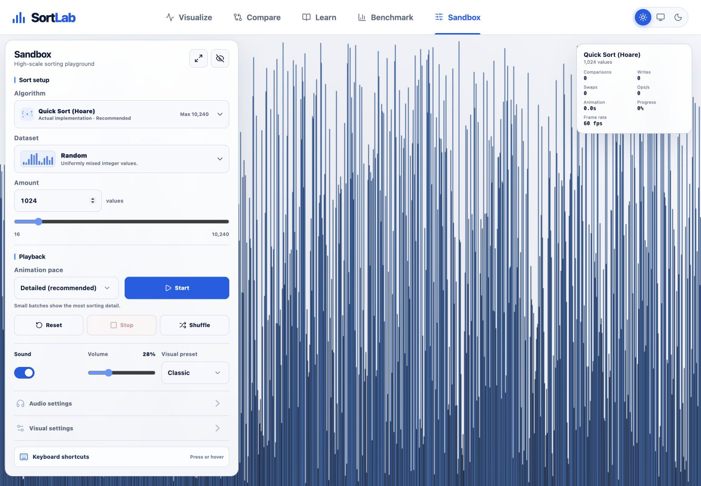

# Sandbox

Sandbox is SortLab's high-scale presentation mode at `#sandbox`. It is deliberately separate from
Visualize: Canvas, speed, audio customization, and cinematic playback take priority over
pseudocode, narration, reverse stepping, and teaching cards.

## Rendering architecture

React owns controls and coarse UI state only. `SandboxRenderer` draws the array on one high-DPI
Canvas 2D surface through a `ResizeObserver`; it never creates a DOM element per value. Canvas size
tracks CSS size and device pixel ratio, and redraws are capped at the selected 30 or 60 fps target.
Background tabs, route changes, and unmounts release the renderer, worker, and audio resources.

WebGL was not justified by profiling at the supported 4,096-value ceiling. Canvas 2D kept the
pipeline smaller and remained responsive at that limit.

## Worker and batching model

`sandbox.worker.ts` executes a Sandbox-specific implementation and emits compact numeric operation
tuples in 512-operation batches. The main thread applies bounded batches once per animation frame:

- Real-time: 12 operations per 60 fps frame
- Fast: 480 operations per 60 fps frame
- Maximum: 3,200 operations per 60 fps frame

The queue asks the worker to pause at a 24,000-operation high-water mark and resumes it at 8,000.
Because one already-sent 512-operation batch may arrive at the boundary, its strict batch-bounded
ceiling is 24,448 operations; the final profile peaked at 21,248. A new run terminates the old
worker, stop responds immediately, route changes terminate work, and no unbounded event history is
retained.

## Algorithms and amount limits

`catalog.ts` contains the complete 200-plus option Sandbox library. It covers exchange,
selection/insertion, Shell gap presets, tree/heap, quicksort configurations, merge, distribution,
radix/string, learned, network, parallel, GPU/vector, external/out-of-core, research, and novelty
groups. Search matches names, aliases, groups, descriptions, and execution labels.

Every option visibly identifies what SortLab is doing:

- **Native:** the worker directly implements the named algorithm used for playback.
- **Conceptual:** the UI animates the documented structure through a bounded family operation model;
  it is not presented as a benchmarkable production implementation.
- **Simulated parallel:** worker lanes and synchronization are conceptual, with no speedup claim.
- **Simulated external:** runs and transfers are modeled without browser disk I/O.
- **Simulated GPU:** GPU/vector stages use a safe CPU fallback and make no hardware claim.
- **Experimental:** optional or research behavior with an explicit fallback.

Native quick, merge, heap, radix, counting, and bitonic paths support up to 4,096 values. Shell
supports 2,048 and quadratic paths stop at 512. Networks enforce power-of-two amounts. Novelty
entries stay discoverable but use strict ceilings: Bogosort 8, Bogobogosort 6, Slowsort 100, and
Stooge Sort 128. Each run also receives a calculated operation budget, a 15-second worker deadline,
immediate Stop cancellation, and worker termination on route changes. Unavailable amounts remain
visible with a reason.

Supported tiers are 64, 128, 256, 512, 1,024, 2,048, and 4,096. Profiling did not justify exposing
8,192.

## Dataset patterns

Sandbox has 30 deterministic presets. In addition to random, sorted, reversed, nearly sorted,
few-unique, duplicate-heavy, sawtooth, and shuffled blocks, it includes all-equal, sine, bell,
uniform, normal, exponential, Zipf, organ-pipe, mountain, valley, alternating high/low, rotated,
scrambled-tail, scrambled-middle, quicksort killers, Timsort runs, radix-friendly integers, large
and small key ranges, signed values, and duplicate clusters. The selected preset persists locally;
sorting never starts automatically.

## Controls and persistence

The floating controls island provides algorithm, Dataset, amount, speed mode, Start / Pause /
Resume, Stop, Reset, Shuffle, Sound, Fullscreen, and Hide interface. Audio settings exposes the
shared engine's preset, waveform, pitch mode, frequency range, ADSR, density, polyphony,
operation-type toggles, and automatic normalization. Visual settings exposes bar gap, width mode,
active brightness, trail, background, values, statistics, legend, completion, quality, and frame
target.

Algorithm, Dataset, amount, speed, visual choices, audio choices, and volume persist locally.
Hidden-interface state intentionally does not persist, and sorting never starts on page load.

## Visual presets

Classic, Neon, Monochrome, Heatmap, Spectrum, and Terminal are centralized in
`src/sandbox/config.ts`. Dense bars communicate active and sorted state with color, brightness,
opacity, and the completion sweep; Sandbox never places marker icons above individual bars.

To add a visual preset, extend `SandboxVisualPresetId`, add all required colors to
`sandboxVisualPresets`, then add registry, persistence, dark-contrast, 4,096-bar, and mobile tests.

## Hidden interface and fullscreen

Hide interface removes the controls island, compresses the header to a translucent 42 px strip,
and leaves a visible Show controls button above the statistics overlay. `H` restores the interface;
Escape restores it before handling fullscreen. Keyboard focus entering the compact header also
restores controls. Space remains available for playback.

Fullscreen uses the browser Fullscreen API when available. Canvas size follows fullscreen entry
and exit, audio continues, and controls remain recoverable. Unsupported browsers keep the control
disabled without changing the route.

Keyboard controls are Space, R, S, M, H, F, Escape, and Arrow Up / Arrow Down for speed.

## Completion sequence

Completion draws a left-to-right sorted sweep whose duration is clamped between 650 and 2,200 ms
and scales with the square root of the amount. Audio plays six ascending sampled notes, not
thousands. The summary offers a New array action and the user can reset or start again immediately.

## Measured profile

Measurements used Chromium, the production-style Canvas/worker path, Maximum mode, a 60 fps
target, Long Tasks API observation, heap sampling where available, queue diagnostics, and engine
voice diagnostics. Results are local observations, not benchmark claims.

| Algorithm        | Values | Wall time | Animation | Streamed ops | Observed fps | Peak queue | Long tasks |
| ---------------- | -----: | --------: | --------: | -----------: | -----------: | ---------: | ---------: |
| Quick Sort Hoare |    256 |    430 ms |    300 ms |        3,348 |           28 |          0 | 1 / 278 ms |
| Quick Sort Hoare |  1,024 |    185 ms |    100 ms |       16,775 |           52 |          0 |          0 |
| Quick Sort Hoare |  4,096 |    515 ms |    400 ms |       74,466 |           55 |     16,866 |          0 |
| Merge Sort       |  4,096 |    532 ms |    500 ms |       87,391 |           58 |     20,864 |          0 |
| Heap Sort        |  4,096 |    765 ms |    700 ms |      130,466 |           60 |     21,248 |          0 |
| Radix Sort LSD   |  4,096 |    104 ms |      0 ms |        8,192 |           59 |          0 |          0 |
| Optimized Bubble |    256 |    654 ms |    300 ms |       48,947 |           54 |          0 |          0 |

The first 278 ms long task occurred during initial page/audio setup; subsequent measured sorting
runs recorded no long task. Measured stop latency was 45 ms. Peak sampled heap growth at 4,096 was
about 20.09 MB for Heap Sort, with other 4,096 runs lower. Active audio voices stayed at or below
the configured 12-voice cap.

## Responsive layout

Desktop uses a floating island. Below 900 px the island becomes a bottom panel while the canvas
remains dominant. At 390 px, inputs use two columns where useful, action buttons retain 44 px touch
height, statistics collapse to four primary values, tooltips no longer create overflow, and the
panel remains vertically scrollable.
